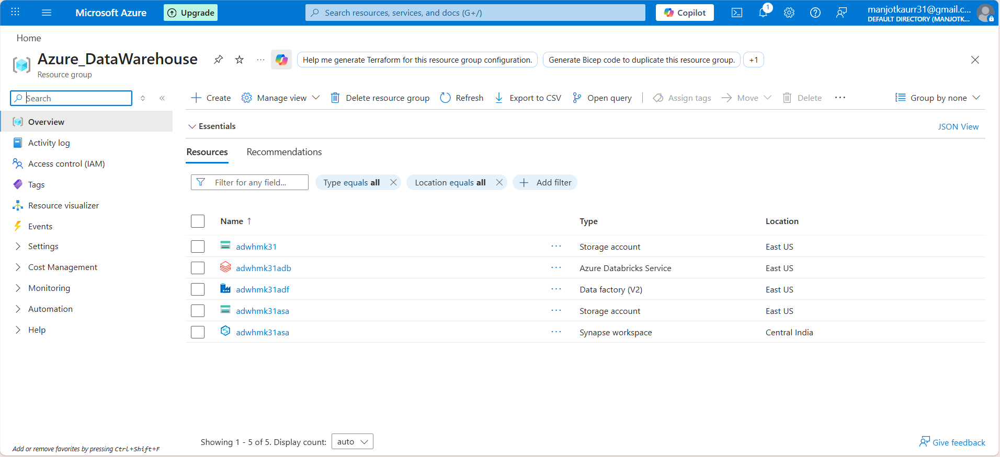
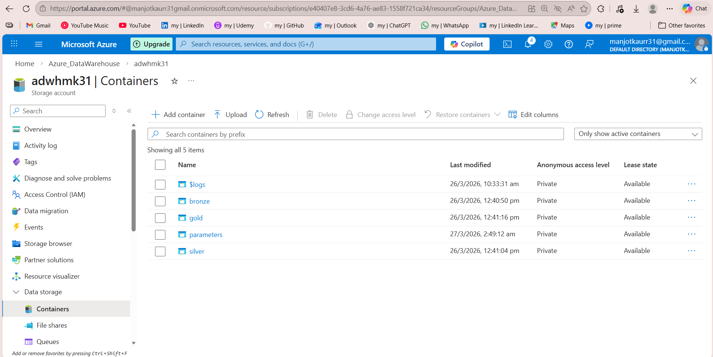
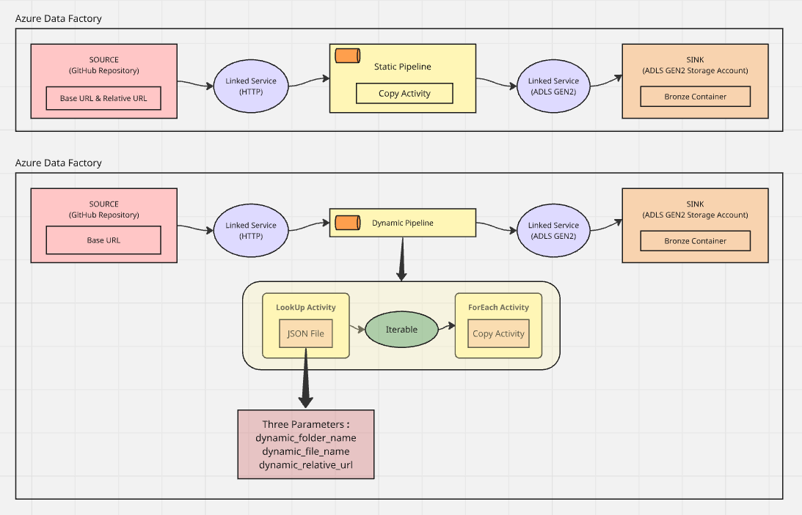
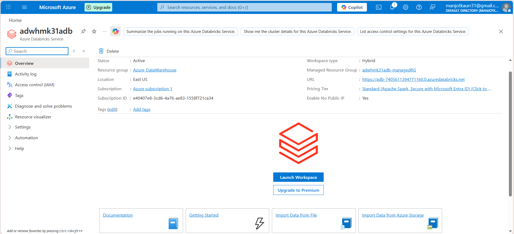
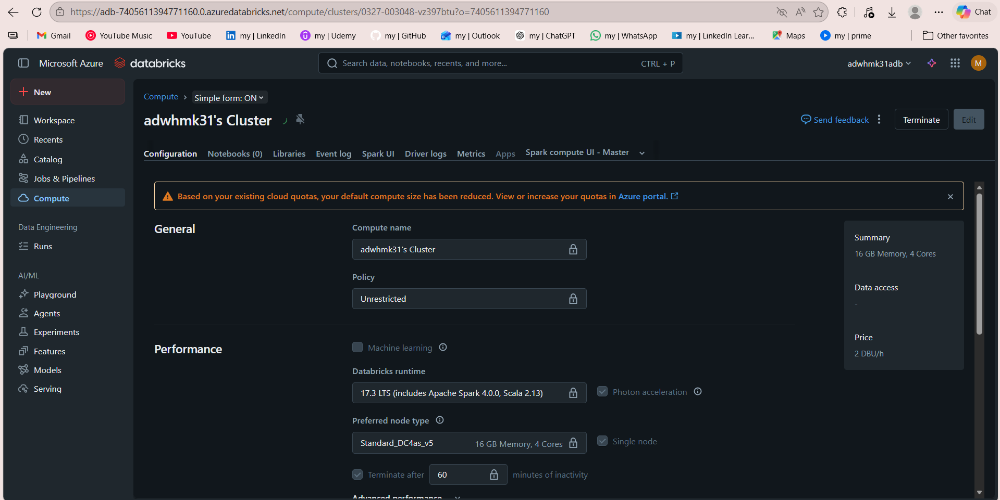
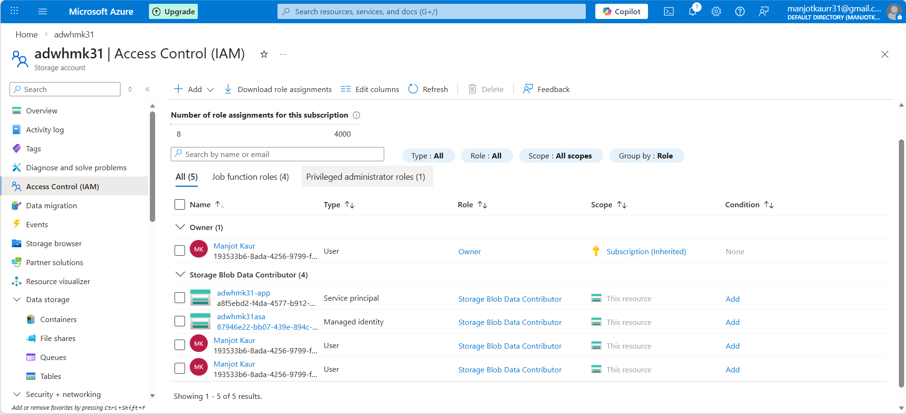
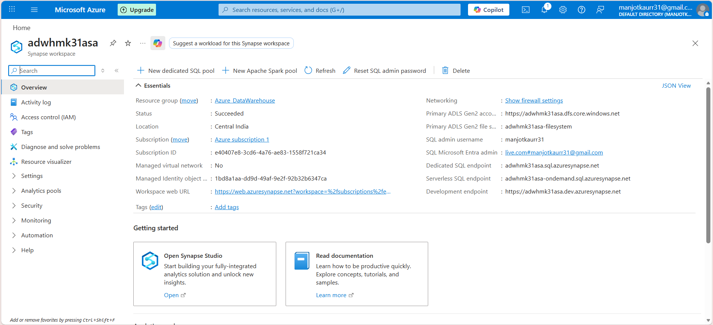
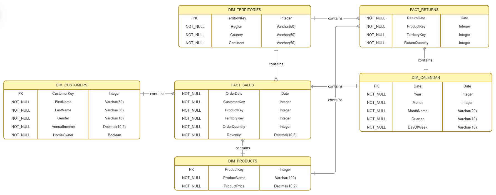

# End-to-End Azure Data Engineering: Azure Data Warehouse

This project demonstrates a production-grade **Medallion Architecture** (Bronze $\to$ Silver $\to$ Gold) built entirely within the Microsoft Azure ecosystem. It automates the extraction of raw retail data from a GitHub HTTP source, processes it using Apache Spark, and models it into a high-performance Star Schema for Business Intelligence.

---

## 🏁 Prerequisites & Environment Setup

Before building the pipelines, the following Azure resources and configurations were established to create a functional Data Warehouse environment:

1.  **Azure Free Account:** Created a new subscription (`Azure subscription 1`) to access cloud services.
2.  **Resource Group:** Provisioned a central container named `Azure_Datawarehouse` to logically group all project assets.
3.  **ADLS Gen2 Storage (`adwhmk31`):** Created with **Hierarchical Namespace (HNS)** enabled to support big data file system operations.
    * **Containers:** `bronze`, `silver`, `gold`, and `parameters`.
4.  **Azure Data Factory (`adwhmk31adf`):** Orchestration engine used to create and manage data pipelines.
5.  **Azure Databricks (`adwhmk31adb`):** Apache Spark-based analytics platform for data transformation.
6.  **Azure Synapse Analytics (`adwhmk31asa`):** Enterprise analytics service used for the SQL-based serving layer.
7.  **Microsoft Entra ID (formerly Azure AD):** Used for creating Service Principals and managing identities for secure resource access.

<p align="center">
  

<p align="center">
  

---

## 🛠️ Phase 1: Data Ingestion (Bronze Layer)

The ingestion phase moves raw CSV files from GitHub to the Data Lake. I implemented two distinct pipeline patterns in **Azure Data Factory (ADF)**.

### 1.1 Ingestion Architecture


* **Source Linked Service:** An HTTP type connector pointing to the GitHub repository.
* **Sink Linked Service:** An Azure Data Lake Storage Gen2 connector pointing to the `adwhmk31` account.

### 1.2 Static & Dynamic Pipelines
* **Static Pipeline (`GitToRaw`):** Validated connectivity by hardcoding the path for a single file (e.g., `Calendar.csv`).
* **Dynamic Pipeline (`DynamicGitToRaw`):** Scaled ingestion for the remaining 9+ files using metadata-driven logic.
    * **Lookup Activity:** Reads the metadata file located at `bronze/DynamicGitToRaw.json`.
    * **ForEach Activity:** Iterates through the JSON array.
    * **Copy Activity:** Dynamically injects `dynamic_relative_url`, `dynamic_folder_name`, and `dynamic_file_name` into the datasets.
 
<p align="center">
  
</p>

**Metadata Control File (`bronze/DynamicGitToRaw.json`):**
```json
[
    {
        "dynamic_relative_url": "manjotkaurr31/Azure_DataWarehouse/refs/heads/main/data/Calendar.csv",
        "bronze_sink_dynamic_folders": "calendar",
        "bronze_sink_dynamic_files": "calendar.csv"
    },
    {
        "dynamic_relative_url": "manjotkaurr31/Azure_DataWarehouse/refs/heads/main/data/Sales_2017.csv",
        "bronze_sink_dynamic_folders": "sales_2017",
        "bronze_sink_dynamic_files": "sales_2017.csv"
    },{...}
]
```

---

## 🧪 Phase 2: Data Transformation (Silver Layer)

Once the data landed in the **Bronze** container, the goal shifted to refining the raw files into a cleaned, standardized format. I used **Azure Databricks** (`adwhmk31adb`) as the primary transformation engine.

### 2.1 Compute and Environment
* **Resource:** Provisioned an Azure Databricks instance within the `Azure_Datawarehouse` resource group.

<p align="center">
  
</p>

* **Cluster Configuration:** Created `adwhmk31's cluster` using the **17.3 LTS** runtime, which includes **Apache Spark 4.0.0** and **Scala 2.13**.
* **Node Type:** Utilized a `Standard_DC4as_v5` node (16 GB Memory, 4 Cores) configured as a single-node cluster to optimize for the project's data volume.

<p align="center">
  

### 2.2 Advanced Access Control (Identity & Access Management)
To bridge the gap between Databricks and the Storage Account without using insecure hardcoded keys, I implemented a **Service Principal** workflow:
1.  **App Registration:** Registered an application named `awdhmk31-app` in **Microsoft Entra ID** and securely stored its Application (client) ID and Directory (tenant) ID.
2.  **Secret Management:** Generated a **Client Secret** (Secret Key) within the app registration to facilitate programmatic authentication.
3.  **RBAC Assignment:** Navigated to the **Access Control (IAM)** settings of the `adwhmk31` storage account and assigned the **Storage Blob Data Contributor** role to the `awdhmk31-app` identity.
4.  **Verification:** This configuration granted the Databricks cluster the specific permissions required to read from `bronze` and write to `silver`.

<p align="center">
  
</p>

### 2.3 Spark Transformation Logic
The core processing is handled by the PySpark notebook located at `silver/silver_nb.ipynb`.
* **Data Ingestion:** Loaded the raw CSV files from the Bronze container into Spark DataFrames.
* **Cleaning Operations:** * Performed schema enforcement to ensure correct data types (e.g., converting strings to Decimals or Dates).
    * Removed duplicates and handled null values to ensure data integrity.
    * Standardized column naming conventions for consistency across all 10+ files.
* **Storage:** The final, "cleansed" datasets were written to the **Silver** container in **Parquet** format to provide compression and columnar performance benefits.

---

## 🏛️ Phase 3: Data Modeling & Serving (Gold Layer)

The final phase involved structuring the data for consumption by end-users (Data Analysts and BI Developers) using **Azure Synapse Analytics** (`adwhmk31asa`).
<p align="center">
  
</p>

### 3.1 Seamless Security with Managed Identity
Unlike Phase 2, which used a Service Principal "middleman," Synapse offers a more streamlined approach through **Managed Identity (MSI)**:
1.  **Identity Activation:** Azure Synapse Analytics automatically comes with a system-assigned managed identity.
2.  **Role Assignment:** I assigned the **Storage Blob Data Contributor** role directly to the `adwhmk31asa` resource via the storage account's IAM panel.
3.  **Personal Access:** I also assigned the same role to my own account to allow for manual data exploration and script execution.
4.  **Result:** This created a "passwordless" environment where Synapse could natively interact with the Data Lake.
<p align="center">
  
</p>

### 3.2 Dimensional Modeling (Star Schema)
I designed a robust **Star Schema** to provide a high-performance structure for analytical queries.
* **Fact Tables:** * `FACT_SALES`: Contains transactional data, revenue, and order quantities.
    * `FACT_RETURNS`: Tracks product return events.
* **Dimension Tables:** * `DIM_CUSTOMERS`: Descriptive attributes for customer demographics.
    * `DIM_PRODUCTS`: Product details including names and prices.
    * `DIM_CALENDAR`: Time-intelligence attributes (Year, Quarter, Month).
    * `DIM_TERRITORIES`: Geographic attributes (Region, Country, Continent).
<p align="center">
  
</p>

### 3.3 Data Serving via CETAS
Using **Serverless SQL Pools**, I developed the SQL script located at `gold/script.sql`.
* **Materialization:** I utilized **CETAS (Create External Table As Select)** to transform the Silver Parquet files into the Gold Star Schema.
* **Final Output:** This process materialized the final modeled data into the **Gold** container.
* **End-User Access:** Analysts can now query the Gold layer using standard T-SQL through the Synapse endpoint, providing a familiar interface for powerful data insights.

---

## 🚀 Key Takeaways

The completion of this end-to-end pipeline represents a transition from basic data movement to a scalable, production-grade cloud architecture.

* **Metadata-Driven Scalability**: By shifting from static hardcoding to a dynamic Lookup-ForEach pattern in ADF, the system can ingest hundreds of new files simply by adding entries to the `DynamicGitToRaw.json` configuration file, requiring zero changes to the pipeline logic itself.
* **Medallion Architecture Efficiency**: Implementing the Bronze-Silver-Gold layering ensures a clear lineage of data, where raw integrity is preserved in Bronze, data is standardized using Spark 4.0 in Silver, and optimized for analytical performance in Gold.
* **Security-First Implementation**: The project moves beyond basic account keys by leveraging **Microsoft Entra ID Service Principals** for Databricks and **System-Assigned Managed Identities** for Synapse, ensuring a passwordless and secure connection to the Data Lake.
* **Performance Optimization with Parquet**: By converting raw CSVs into Parquet format in the Silver and Gold layers, the pipeline significantly reduces storage costs and improves query performance through columnar compression and efficient schema enforcement.
* **Serverless SQL Materialization**: Utilizing **CETAS** in Azure Synapse Analytics allows for the materialization of a Star Schema directly into the Gold container, providing a high-performance, cost-effective serving layer for BI tools like Power BI.
